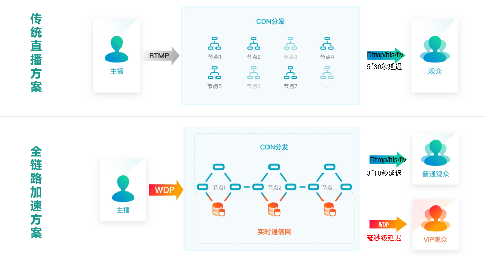
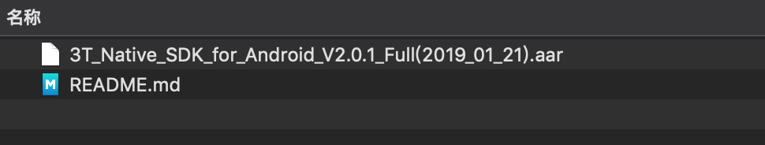

# 低延迟直播
在互联网直播场景中，直播活动的失败80%是由于主播端推流网络抖动造成的，同时国内网络运营商众多，跨运营商传输链路极其复杂，金融、赛事、教育等直播场景下，对于低延时需求迫切。

## 典型场景
传统方式下主播端通过RTMP协议推流到流媒体服务器，最终将流转发到CDN加速网络，用户端通过HLS/RTMP/FLV等协议向CDN请求播放直播流。由于主播端推流采用RTMP协议，而RTMP协议基于TCP协议基础上，TCP协议虽能为两个端点间的数据传输提供相对可靠的保障，但是当网络出现抖动时会出现频繁的握手和重传，导致延时较大，马赛克、卡顿等问题较为严重。在实际应用场景中，由于推流端源头网络波动导致直播成功率难度指数级增加，直播音视频质量急剧下降，且传统方式下微信等终端播放延时超过15秒以上，整个直播效果也会很差。

为了更好的应对传统直播过程中遇到的主播推流源端网络不稳定带来的直播体验问题，三体云基于在音视频行业多年技术积累自研的WDP直播协议及3T-RTN网络，实现弱网情况下30%抗丢包能力，在主播端提供高质量、低延迟、快捷接入的音视频传输基础服务，同时针对观众端的跨终端特性，深度优化了HLS播放协议，大幅降低播放端延迟，将传统直播下15秒以上的延迟缩短到毫秒级，极大改善了用户观看体验。

# 架构设计

以上架构图对比展示了传统直播方案与低延迟直播方案在主播端推流稳定性及观看端延迟方面的改善，采用三体云低延迟直播方案可以大幅提升主播端推流的稳定性及弱网环境下的流畅度，同时给观看端带来更低的延迟，用户体验显著提升。

# 示例程序

#### 准备工作
1. 在三体云官网SDK下载页 [http://3ttech.cn/index.php?menu=53]() 下载对应平台的 连麦直播SDK；
2. 登录三体云官网 [http://dashboard.3ttech.cn/index/login]() 注册体验账号，进入控制台新建自己的应用并获取APPID；
3. 下载DEMO源码，将APPID填入代码中相应的位置并体验效果。

# 实现步骤

1. 创建 TTT 音视频引擎对象 [create](http://www.3ttech.cn/index.php?menu=72&type=Android#create)
2. 设置频道模式，低延迟直播 场景下频道模式需要设定为直播模式 [setChannelProfile](http://www.3ttech.cn/index.php?menu=72&type=Android#setChannelProfile)
3. 设置用户角色，低延迟直播 场景下需要角色设定为主播 [setClientRole](http://www.3ttech.cn/index.php?menu=72&type=Android#setClientRole) 
4. 设置 SDK 的 CDN 推流地址 [configPublisher](http://www.3ttech.cn/index.php?menu=72&type=Android#configPublisher) 
5. 设置视频编码分辨率 [setVideoProfile](http://www.3ttech.cn/index.php?menu=72&type=Android#setVideoProfile)
6. 低延迟直播(开启上行加速) [enableUplinkAccelerate](http://www.3ttech.cn/index.php?menu=72&type=Android#enableUplinkAccelerate)
7. 设置编码格式是AAC [setPreferAudioCodec](http://www.3ttech.cn/index.php?menu=72&type=Android#setPreferAudioCodec)
8. 加入频道 [joinChannel](http://www.3ttech.cn/index.php?menu=72&type=Android#joinChannel)

# 示例程序

#### 准备工作
1. 在三体云官网SDK下载页 [http://3ttech.cn/index.php?menu=53](http://3ttech.cn/index.php?menu=53) 下载对应平台的 连麦直播SDK。
2. 登录三体云官网 [http://dashboard.3ttech.cn/index/login](http://dashboard.3ttech.cn/index/login) 注册体验账号，进入控制台新建自己的应用并获取APPID。

#### Android

1. 解压下载的 SDK 压缩包，内容如图所示

2. 用Android Studio，打开**Android-PK** Demo工程，文件列表如图所示，复制**3T\_Native\_SDK\_for\_Android\_Vx.x.x\_Full.aar** 到工程 **app** 项目下的 **libs** 目录下。
 
 
 
3. 引用aar包。在app项目下的build.gradle文件中添加红框中相应代码来引用。
 
 
 

4. 将申请到的**APPID**填入 SDK 的初始化函数 create 中，如下图所示。

5. 最后编码代码即可运行Demo。

	运行环境:
    * Android Studio 3.4
    * minSdkVersion 16
    * gradle 5.1.1
    * java 8.0

	Android权限要求:
	
	  * **android.permission.CAMERA** ---> SDK视频模块需要使用此权限用来访问相机，用于获取本地视频数据。
     * **android.permission.RECORD_AUDIO** ---> SDK音频模块需要使用此权限用来访问麦克风，用于获取本地音频数据。
     * **android.permission.INTERNET** ---> SDK的直播和通讯功能，均需要使用网络进行上传。
     * **android.permission.BLUETOOTH** ---> SDK的直播和通讯功能，均需要访问蓝牙权限，保证用户能正常使用蓝牙耳机。
     * **android.permission.BLUETOOTH_ADMIN** ---> 蓝牙权限。
     * **android.permission.MODIFY\_AUDIO\_SETTINGS** ---> SDK的直播和通讯功能，均需要访问音频路由，保证能正常切换听筒，扬声器，耳机等路由切换。
     * **android.permission.ACCESS\_NETWORK\_STATE** ---> SDK的直播和通讯功能，均需要访问网络状态。
     * **android.permission.READ\_PHONE\_STATE** ---> SDK的直播和通讯功能，均需要访问手机通话状态。

# 常见问题
1. 由于部分模拟器会存在功能缺失或者性能问题，所以 SDK 不支持模拟器的使用。

2. 低延迟直播不支持连麦功能。

