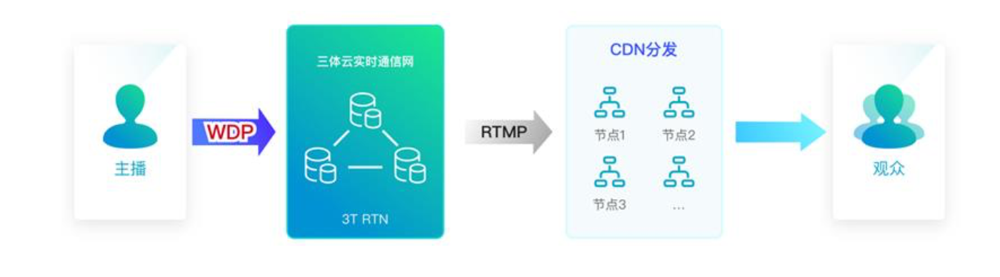
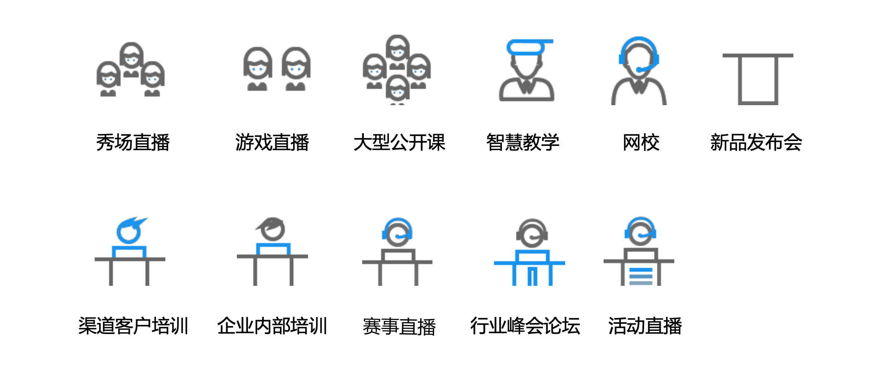
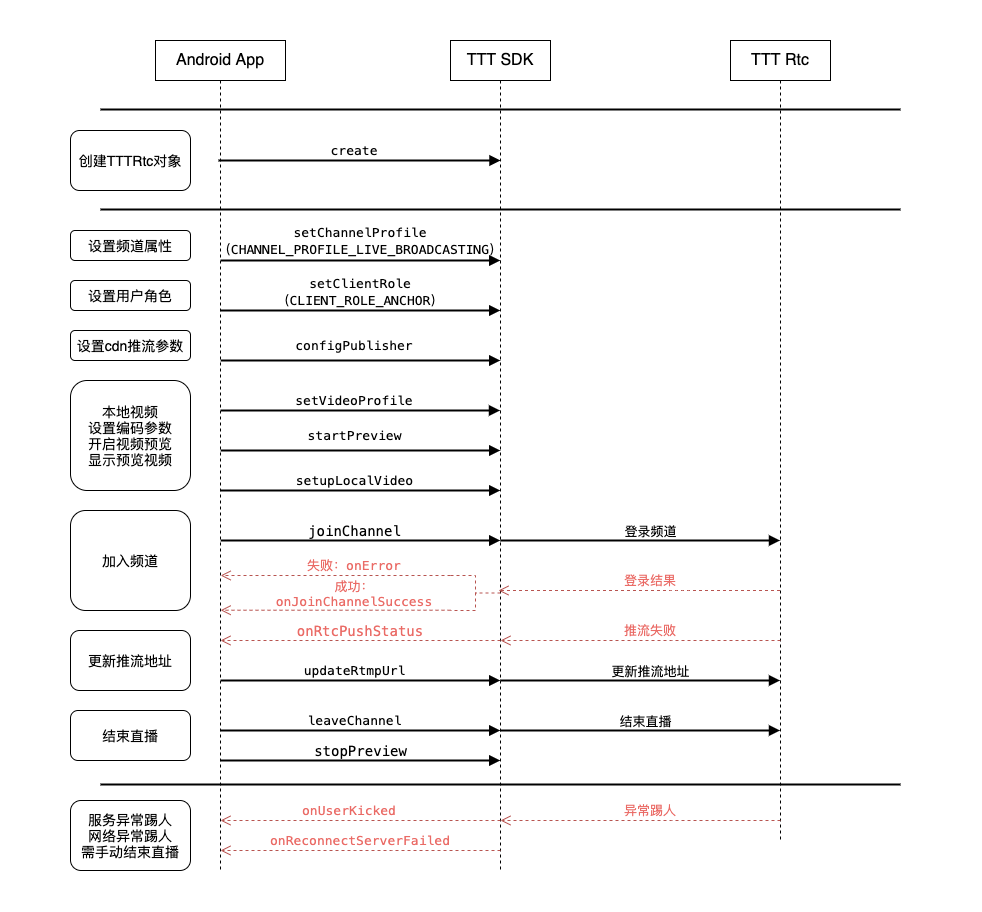

# 3T-Edge直播全链路加速
直播全链路加速产品(3T-Edge)是三体云针对直播场景推出的全链路加速产品，旨在依托三体云遍布全网的加速节点，海量带宽网络等优越的基础设施，日均百万级实时 音视频并发处理能力，为直播类客户提供更快、更稳定的网络接入能力，有效提升直播 应用的可用性和用户体验。

## 应用场景

## 技术优势与特点

**1. 30%超强抗丢包，2.5 秒网络延迟无感知**

**2. 卡顿率降低40%以上**

**3. 端到端延迟降低33%以上**

**4. 通用播放器及通用直播协议，无需特殊协议**

## SDK接口流程

## 接口使用列表

首先保证SDK创建**TTTRtcEngineKit**单例对象 [TTTRtcEngine.create(...)](http://doc3.3ttech.cn/live/client-api/android/methods.html#create)

接口列表：

1. 设置直播模式 [setChannelProfile](http://doc3.3ttech.cn/live/client-api/android/methods.html#setChannelProfile)
2. 设置用户角色为主播 [setClientRole](http://doc3.3ttech.cn/live/client-api/android/methods.html#setClientRole)
3. cdn推流参数设置 [configPublisher](http://doc3.3ttech.cn/live/client-api/android/methods.html#configPublisher)
4. 设置编码参数 [setVideoProfile](http://doc3.3ttech.cn/live/client-api/android/methods.html#setVideoProfile)
5. 开启预览 [startPreview](http://doc3.3ttech.cn/live/client-api/android/methods.html#startPreview)
6. 显示本地预览 [setupLocalVideo](http://doc3.3ttech.cn/live/client-api/android/methods.html#setupLocalVideo)
7. 加入频道 [joinChannel](http://doc3.3ttech.cn/live/client-api/android/methods.html#joinChannel)
8. 更新cdn推流地址 [updateRtmpUrl](http://doc3.3ttech.cn/live/client-api/android/methods.html#updateRtmpUrl)
9. 离开频道，直播结束 [leaveChannel](http://doc3.3ttech.cn/live/client-api/android/methods.html#leaveChannel)
10. 停止预览 [stopPreview](http://doc3.3ttech.cn/live/client-api/android/methods.html#stopPreview)

回调列表：

1. 加入房间Error [onError](http://doc3.3ttech.cn/live/client-api/android/callbacks.html#onError)
2. 加入房间成功 [onJoinChannelSuccess](http://doc3.3ttech.cn/live/client-api/android/callbacks.html#onJoinChannelSuccess)
3. 推流成功或失败回调 [onRtcPushStatus](http://doc3.3ttech.cn/live/client-api/android/callbacks.html#onRtcPushStatus)
4. 异常踢人 [onUserKicked](http://doc3.3ttech.cn/live/client-api/android/callbacks.html#onUserKicked)
5. 网络连接异常 [onConnectionLost](http://doc3.3ttech.cn/live/client-api/android/callbacks.html#onConnectionLost)
6. 网络重连成功 [onReconnectServerSucceed](http://doc3.3ttech.cn/live/client-api/android/callbacks.html#onReconnectServerSucceed)
7. 网络重连失败 [onReconnectServerFailed](http://doc3.3ttech.cn/live/client-api/android/callbacks.html#onReconnectServerFailed)

## 示例程序

#### 准备工作
1. 下载Android SDK [TTTRtcEngine](https://github.com/santiyun/Android-LiveSDK)
2. 登录三体云官网 [http://dashboard.3ttech.cn/index/login](http://dashboard.3ttech.cn/index/login) 注册体验账号，进入控制台新建自己的应用并获取APPID。

## 示例工程配置

运行环境:
	
    * Android Studio 3.6.1
    * minSdkVersion 18
    * gradle 5.6.4
    * java 8.0

权限要求:
	
	  * android.permission.CAMERA** ---> SDK视频模块需要使用此权限用来访问相机，用于获取本地视频数据。
     * android.permission.RECORD_AUDIO** ---> SDK音频模块需要使用此权限用来访问麦克风，用于获取本地音频数据。
     * android.permission.INTERNET** ---> SDK的直播和通讯功能，均需要使用网络进行上传。
     * android.permission.BLUETOOTH** ---> SDK的直播和通讯功能，均需要访问蓝牙权限，保证用户能正常使用蓝牙耳机。
     * android.permission.BLUETOOTH_ADMIN** ---> 蓝牙权限，保证SDK可以根据需要使用蓝牙耳机等。
     * android.permission.MODIFY_AUDIO_SETTINGS** ---> SDK的直播和通讯功能，均需要访问音频路由，保证能正常切换听筒，扬声器，耳机等路由切换。
     * android.permission.ACCESS_NETWORK_STATE** ---> SDK的直播和通讯功能，均需要访问网络状态。
     * android.permission.READ_PHONE_STATE** ---> SDK的直播和通讯功能，均需要访问手机通话状态。
   
配置工程:

1. 解压下载的 SDK 压缩包，用 Android Studio 打开工程，复制**3T\_Native\_SDK\_for\_Android\_Vx.x.x\_Full.aar** 到工程 **app** 项目下的 **libs** 目录下。
 
 
3. 引用aar包。在app项目下的build.gradle文件中添加红框中相应代码来引用。
 
 

4. 将申请到的**APPID**填入 SDK 的初始化函数 create 中，如下图所示。

5. 最后编码代码即可运行Demo。

# 常见问题
1. 由于部分模拟器会存在功能缺失或者性能问题，所以 SDK 不支持模拟器的使用。
